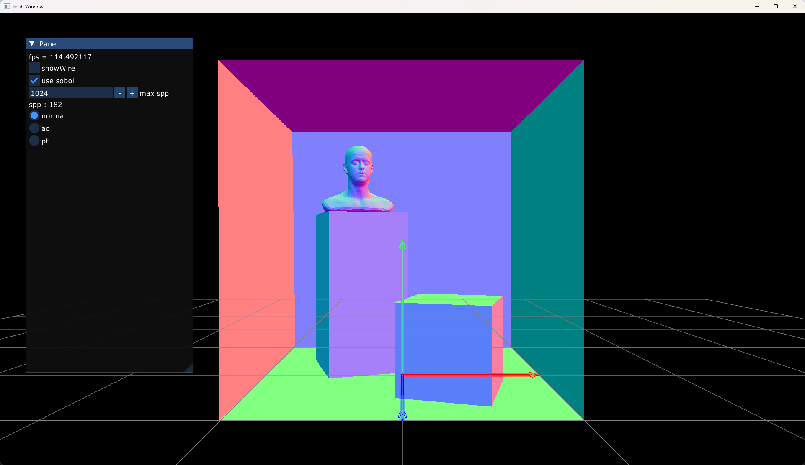
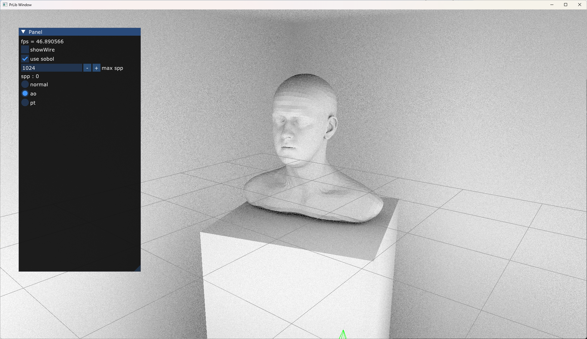
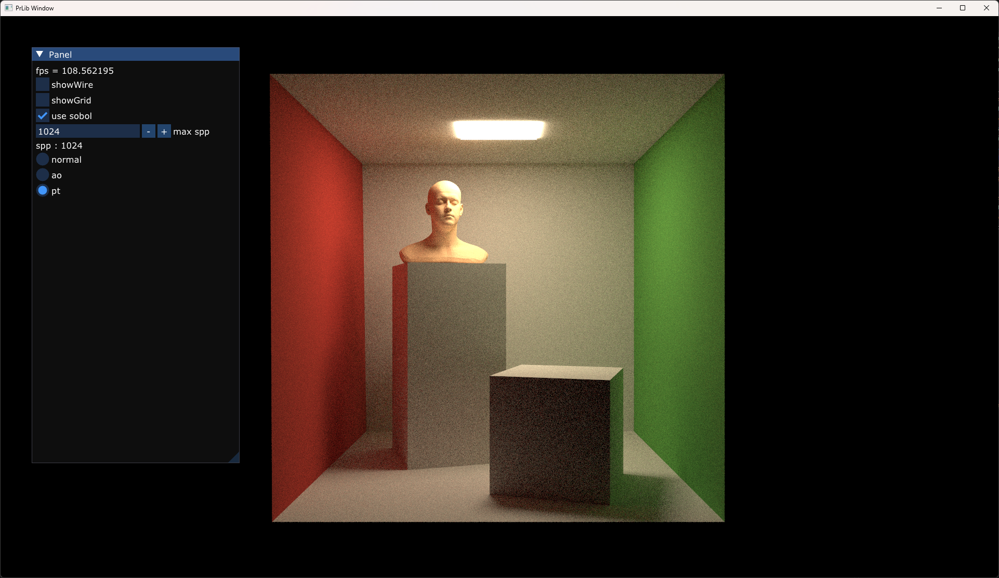

## Simple and Minimum LBVH for ray tracing
LBVH construction from "Fast and Simple Agglomerative LBVH Construction" and stackfree ray traversal based via "A Stack-Free Traversal Algorithm for Left-Balanced k-d Trees", but not left-balanced. This implementation keeps it as simple as possible and all self-contained; thus performance is sacrificed.

## build
```
git submodule update --init
premake5 vs2022
```

### Normal
 

### AO
 

### Path Tracing
 

## Reference
- [Fast and Simple Agglomerative LBVH Construction](https://diglib.eg.org/items/3aca7692-f2be-4b5d-a7f0-b7a865be6e5b)
- [A Stack-Free Traversal Algorithm for Left-Balanced k-d Trees](https://ingowald.blog/2022/10/25/stack-free-k-d-tree-traversal/)
- [Practical Hash-based Owen Scrambling](https://jcgt.org/published/0009/04/01/)
- [An Implementation Algorithm of 2D Sobol Sequence Fast, Elegant, and Compact](https://diglib.eg.org/items/57f2cdeb-69d9-434e-8cf8-37b63e7e69d9)
- [Hash Functions for GPU Rendering](https://jcgt.org/published/0009/03/02/)
- [Onesweep radixsort implementation](https://gpuopen.com/learn/boosting_gpu_radix_sort/)